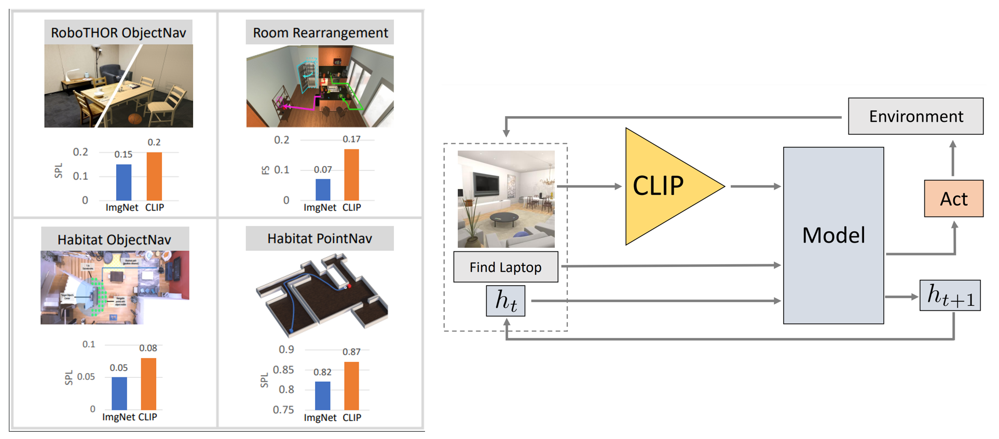

# Embodied CLIP

Official repository for **Simple but Effective: CLIP Embeddings for Embodied AI**

[[Paper]](https://arxiv.org/abs/2111.09888) [[Short Video]](https://www.youtube.com/watch?v=bnzgmlLePxw)

We present competitive performance on navigation-heavy tasks in Embodied AI using frozen visual representations from [CLIP](https://github.com/openai/CLIP).

This repository includes all code and pretrained models necessary to replicate the experiments in our paper. We have included forks of other repositories as branches, as we find this is a convenient way to centralize our experiments and track changes.

**Please see the following links with detailed instructions on how to replicate each experiment:**

- Baselines
  - [RoboTHOR ObjectNav](./readme_files/baselines_robothor_objectnav.md) (Sec. 4.1)
  - [iTHOR Rearrangement](./readme_files/baselines_ithor_rearrangement.md) (Sec. 4.2)
  - [Habitat ObjectNav](./readme_files/baselines_habitat.md) (Sec. 4.3)
  - [Habitat PointNav](./readme_files/baselines_habitat.md) (Sec. 4.4)
- [Probing for Navigational Primitives](./readme_files/primitive_probing.md) (Sec. 5)
- [ImageNet Acc vs. ObjectNav Success](./readme_files/primitive_probing.md) (Sec. 6)
- [Zero-shot ObjectNav in RoboTHOR](./readme_files/zeroshot_objectnav.md) (Sec. 7)



## Citation

```
@inproceedings{khandelwal2022:embodied-clip,
   author    = {Khandelwal, Apoorv and Weihs, Luca and Mottaghi, Roozbeh and Kembhavi, Aniruddha},
   title     = {Simple but Effective: CLIP Embeddings for Embodied AI},
   booktitle = {Proceedings of the IEEE/CVF Conference on Computer Vision and Pattern Recognition (CVPR)},
   month     = {June},
   year      = {2022}
}
```
